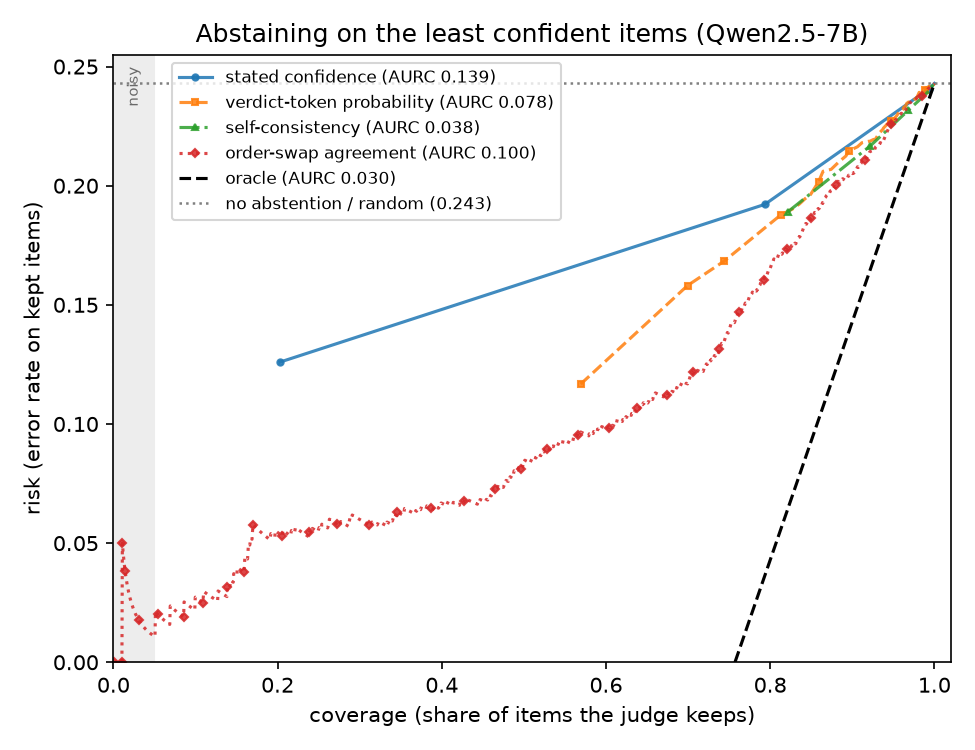
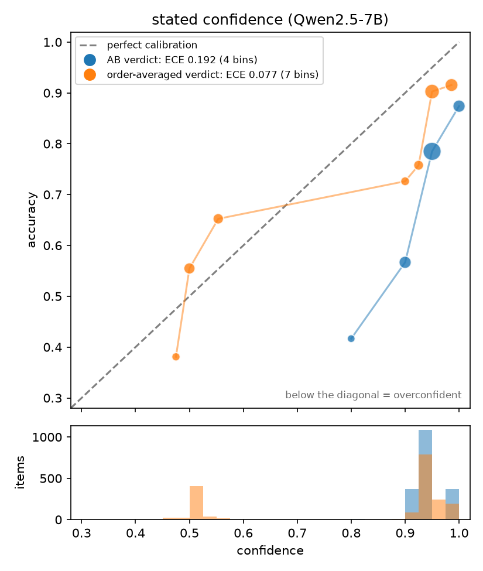

# Do LLM Judges Know When They're Wrong?

An empirical study of whether small open-weight LLM judges know when they are
wrong, and whether their uncertainty is good enough to drive **selective
evaluation**: trust the judge where it is confident, escalate to a human where
it isn't.

Three judges, 1,904 MT-Bench pairwise comparisons, graded against human votes,
under clean inputs and two attacks (swapping answer order, padding answers with
filler).


## Key findings

1. **Every confidence signal is overconfident, for all three judges.**
   Qwen2.5-7B-Instruct's verbalized confidence exceeds its accuracy by
   **19 points** (0.192 [0.172, 0.213]). On pairs with nothing to judge
   (identical or empty answers) it is *more* confident (0.97) than on real
   ones (0.95). Asking twice with the answers swapped and averaging the two
   stated confidences cuts the gap to 4 points (0.038 [0.018, 0.059]).
2. **Better signals exist, and they are cheap.** An order-swap agreement
   signal (ask twice with the answers swapped, measure how much the two
   calls agree) is the best error detector for every judge: AUROC
   **0.794** for Qwen, 0.77–0.78 for kev-8b, 0.68 for auto-j. Abstaining on
   the items it is least sure of cuts Qwen's error rate from 24% to 14%
   when keeping three quarters of items, and to 8% when keeping half.
3. **Filler padding silently breaks Qwen's best signal.** Padding answers
   doesn't change how often Qwen is right, but its best signal's
   calibration degrades significantly (ΔECE +0.043 [0.011, 0.052]), and
   error detection drops for every signal. An abstention policy tuned on
   clean data would lose reliability with no accuracy-side warning. The
   other two judges' calibration holds up under the same attack.
4. **A learned meta-model adds nothing over the best single signal.** For
   all three judges, a model combining every cheap feature (logistic
   regression, gradient boosting, Bayesian hierarchical) never significantly
   beats the best single uncertainty signal. The judge's own signals already carry the
   recoverable information. The meta-model's edge does grow where humans
   agree (H4 interaction +2.38 [1.68, 3.07]), so errors are learnable where
   the ground truth is clear.
5. **A single-call model can replace a 3-prompt ensemble.** A Bayesian
   meta-model keeps 98.7% of the ensemble's discrimination at a third of the
   inference cost, and is better calibrated (ECE 0.034 vs 0.071). But
   its uncertainty does *not* rise under the padding attack, which is the
   one situation it would be needed.
6. **Judge-specific training helps with position bias, but fails in a new
   way.** auto-j-13b flips its verdict on answer-order swap half as often
   as the others (12–14% vs 21–28%). Under padding, though, it fails to
   produce any verdict on up to **39.8%** of calls. Neither other judge
   can fail this way.

<p align="center">
  
  
</p>

Full results, confidence intervals and caveats: [`REPORT.md`](REPORT.md).
Every table and figure it cites is in [`results/`](results).

## The three judges

| Judge | What it is | RQ | Signals |
|---|---|---|---|
| Qwen2.5-7B-Instruct | General-purpose instruction model, JSON-constrained output | RQ1–RQ5 | verbalized confidence, verdict logprob, self-consistency, order-swap entropy, 3-prompt ensemble entropy |
| kev-8b | Open stand-in for an industry "calibrated decision model" claim; never trained to judge | RQ6 | class probability, order-swap entropy |
| auto-j-13b (GPTQ 4-bit) | Llama-2-13B fine-tuned specifically for pairwise judging | RQ7 | self-consistency, order-swap entropy |

### Side-by-side

| | Qwen2.5-7B | kev-8b | auto-j-13b |
|---|---|---|---|
| Best signal AUROC (error detection) | 0.794 | 0.772 / 0.781 | ~0.68 |
| Best signal's overconfidence | +0.10 | +0.07 / +0.05 | +0.13 / +0.10 |
| Position-swap flip rate | 27.8% | 24.6% / 21.1% | 12.5% / 13.8% |
| Padding breaks best signal's calibration? | yes | no | no* |
| Calls with no usable verdict under padding† | 0% | 0% | 13.6% / 39.8% |
| Meta-model significantly beats best signal? | no | no | no |

kev-8b values are split by kev's training coverage (≤ / > 1,024 input
tokens). auto-j values are split by turn 1 / turn 2. \*Among the calls
auto-j actually answered. †Of the calls that ran; kev-8b and auto-j each
skip a small number of padded prompts longer than their context limit.

## Research questions

| RQ | Question |
|---|---|
| RQ1 | Is the judge's stated confidence calibrated? |
| RQ2 | Is any cheap uncertainty signal informative about error? |
| RQ3 | Does uncertainty flag errors caused by position and verbosity bias, or is the fooled judge still confident? |
| RQ4 | Can a cheap supervised meta-model beat the best single signal at predicting judge error? |
| RQ5 | Does an ensemble over judge prompts improve uncertainty, and does that survive distillation to one call? |
| RQ6 | Does kev-8b, a stand-in for an industry calibration claim, resist the same failure modes? |
| RQ7 | Does auto-j-13b, trained specifically to judge, resist them? |

## Why the numbers can be trusted

MT-Bench has only **80 questions**; each is judged across many model pairs,
so items are not independent. The main safeguards:

- **Grouping by question everywhere.** Bootstrap CIs resample questions, not
  rows. Cross-validation is `StratifiedGroupKFold` repeated over 10 seeds,
  reporting the across-seed spread.
- **Paired comparisons.** Clean vs attacked, and one signal vs another, are
  compared on the same items with a paired bootstrap, using the same signal
  construction on both sides.
- **A permutation null for every predictive result.** Labels are shuffled
  within each question so the null keeps each question's difficulty.
- **Accuracy is always reported with Cohen's κ, and ECE with AUROC and the
  signed overconfidence gap.** Each of these can look good alone while
  hiding a useless judge.
- **No hyperparameter tuning.** Model settings were fixed and
  [preregistered](PREREGISTRATION.md) before the main run.
- **Bayesian fits ship with convergence diagnostics** (R-hat, ESS,
  divergences), and a held-out question's random intercept is drawn from the
  population prior, never fitted.
- **Negative results are reported as such.** Two preregistered predictions
  failed (RQ5) and are written up as failures.

The full list of statistical rules is in [`CLAUDE.md`](CLAUDE.md) §2. Every
non-obvious choice and its reasoning is in [`DECISIONS.md`](DECISIONS.md).

## How it runs

```
MT-Bench human votes ──► src/data.py ──► items_labels.parquet
                                              │
            ┌─────────── Colab GPU ───────────┤
            │  src/judge.py / judge_kev.py /  │   notebooks/ = the actual sessions
            │  judge_autoj.py → runs/*.jsonl  │
            └───────────────┬─────────────────┘
                            ▼  (copied back via Drive)
      src/parse.py ──► calls.parquet ──► src/signals.py ──► items.parquet
                                                               │
                                     analysis/rq1.py … rq7.py ─┴─► results/*.csv, figures/
```

- **GPU inference** runs on Colab (L4) with vLLM. [`notebooks/`](notebooks)
  holds the real sessions, with outputs kept:
  `01_qwen_inference`, `02_kev_inference`, `03_autoj_inference`.
- **Everything else** (parsing, signals, statistics, Bayesian models,
  figures) runs locally on CPU.
- Every call is checkpointed, so runs resume after a disconnect. Every row
  records the model, prompt hash, git SHA and seed.
- `results/` holds every result table (CSV) and figure. Raw checkpoints
  (`runs/`) and the intermediate parquet tables are not in git.

## Repository map

| Path | Contents |
|---|---|
| [`REPORT.md`](REPORT.md) | Results and interpretation, one section per RQ |
| [`PLAN.md`](PLAN.md) | Design rationale and the week plan |
| [`DECISIONS.md`](DECISIONS.md) | Design decisions and their reasoning (D4–D28) |
| [`PREREGISTRATION.md`](PREREGISTRATION.md) | Hypotheses and settings frozen before the main run |
| [`TASKS.md`](TASKS.md) | Task list with definitions of done and closeout notes |
| [`CLAUDE.md`](CLAUDE.md) | Statistical invariants, data schemas, layout, commands |
| `src/` | Pipeline: data, prompts, judges, parsing, signals, metrics, bootstrap, predictors, Bayesian model, plots |
| `analysis/` | One CLI script per RQ, the vacuum, decoding-ablation and human-disagreement checks, and the three-judge comparison |
| `results/` | Every result table (CSV) and figure (`figures/`) that `REPORT.md` cites |
| `tests/` | One test file per `src/` module, with hand-computed reference cases |
| `notebooks/` | Colab sessions for the three GPU inference runs |
| `configs/` | One YAML per judge |

## Setup

Local (all analysis, no GPU):

```
conda create -n judge-calib python=3.11
conda activate judge-calib
pip install -e .
pytest
```

Colab (judge inference only), inside a fresh venv:

```
pip install -e ".[colab]"
```

The full command sequence, from building the item table to each RQ's
analysis, is in [`CLAUDE.md`](CLAUDE.md) §7.

## Limitations

- One benchmark (MT-Bench), 80 questions, and mostly 2–5 human votes per
  item, so human disagreement is measured coarsely.
- kev-8b was never trained to judge, so RQ6 tests how far its calibration
  carries over to an unfamiliar task, not a like-for-like comparison.
- auto-j-13b is run 4-bit quantized. Its signals are built from
  self-consistency, which is coarser than the other judges' logprob-based
  signals.
- The primary judge's output is JSON-schema constrained. A 100-item ablation
  found this changes the verdict on 4% of items.

## Status

RQ1–RQ7 are complete. Remaining: a Gradio demo, the report's framing
sections, and a fresh-clone reproducibility check (`REPRODUCE.md`).

## License

All rights reserved — see [`LICENSE`](LICENSE). This is a private
certification capstone, not an open-source release.
