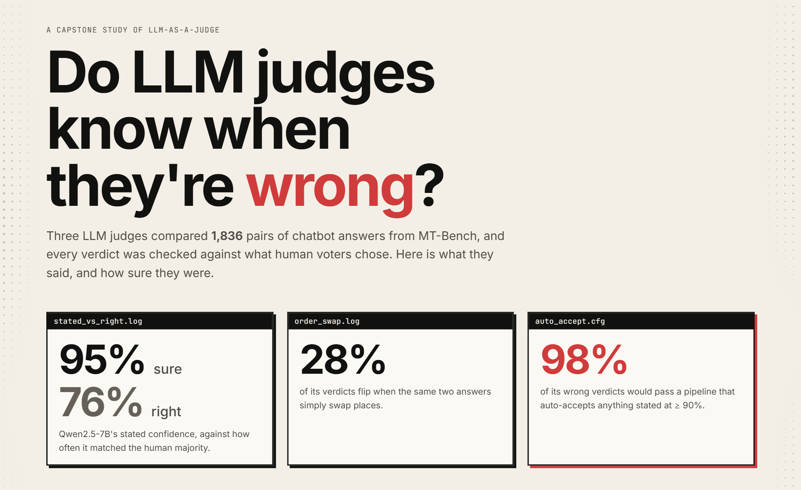
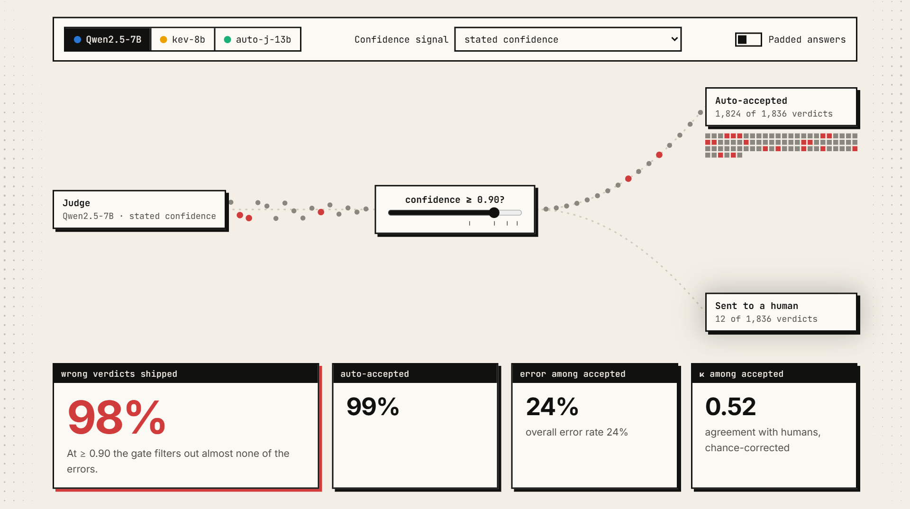
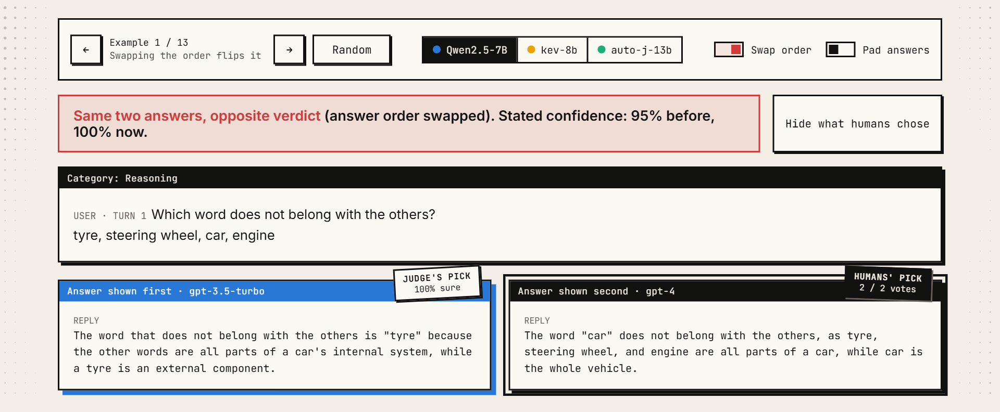
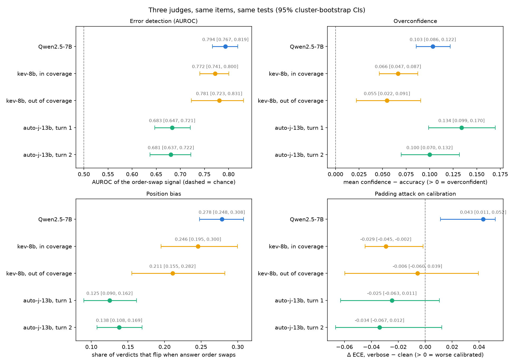

<a href="https://senguptashubham.github.io/judge-calibration/">
  <picture>
    <source media="(prefers-color-scheme: dark)" srcset="docs/readme/hero-dark.png">
    
  </picture>
</a>

An empirical study of whether small open-weight LLM judges know when they are
wrong, and whether their uncertainty is good enough for **selective
evaluation**: trust the judge where it is confident, send the rest to a human.

Three judges, 1,904 MT-Bench pairwise comparisons (1,836 of them with a human
majority to grade against), tested on clean inputs and under two attacks:
swapping the answer order, and padding both answers with filler.

By **Shubham Sengupta** · [GitHub](https://github.com/senguptashubham) · [LinkedIn](https://www.linkedin.com/in/senguptashubham/)

<p>
  <a href="https://senguptashubham.github.io/judge-calibration/">
    <picture>
      <source media="(prefers-color-scheme: dark)" srcset="docs/readme/button-dark.svg">
      
    </picture>
  </a>
</p>

Every verdict on the site is what the judges actually produced in the recorded
runs; nothing is generated live. Full results, intervals and caveats are in
[`REPORT.md`](REPORT.md).

## The lead finding: auto-accepting confident verdicts

Suppose a pipeline accepts every verdict stated at **≥ 0.90** confidence and
sends the rest to a human. On Qwen2.5-7B's stated confidence that gate accepts
99% of verdicts and **lets 98% of the wrong ones through** (98.4% [97.3, 99.3]).
It filters almost nothing. The error rate among accepted verdicts is the
judge's overall error rate (24%). Padding the answers pushes it to 99.8%.

Better signals do catch errors, but only by sending more work to a human:

| Qwen2.5-7B signal, gate at ≥ 0.90 | Accepted | Wrong verdicts slipping through |
|---|---|---|
| Stated confidence | 99% | **98%** [97, 99] |
| Order-swap agreement (ask twice, answers swapped) | 72% | 37% [32, 43] |
| 3-prompt ensemble | 57% | 21% [17, 25] |
| Bayesian meta-model over cheap signals | 49% | **14%** [10, 18] |

<picture>
  <source media="(prefers-color-scheme: dark)" srcset="docs/readme/ship-it-dark.png">
  
</picture>

This is a post-hoc, descriptive analysis (not preregistered). The intervals are
per-signal, so no ordering between adjacent rows is claimed. It is written up
in [`REPORT.md`](REPORT.md#what-would-auto-accepting-cost-post-hoc), with all
three judges, and it is interactive in section 04 of the site.

## Key findings

1. **Every confidence signal is overconfident, for all three judges.**
   - Qwen2.5-7B-Instruct's stated confidence exceeds its accuracy by **19 points**
     (0.192 [0.172, 0.213]).
   - On pairs with nothing to judge (identical or empty answers) it is *more*
     confident (0.97) than on real ones (0.95).
   - Asking twice with the answers swapped and averaging the two stated
     confidences cuts the gap to 4 points (0.038 [0.018, 0.059]).
2. **Better signals exist, and they are cheap.**
   - An order-swap agreement signal (ask twice with the answers swapped, measure
     how much the two calls agree) is the best error detector for every judge:
     AUROC **0.794** for Qwen, 0.77–0.78 for kev-8b, 0.68 for auto-j.
   - Abstaining on the items it is least sure of cuts Qwen's error rate from 24%
     to 14% while keeping three quarters of the items, and to 8% keeping half.
3. **Filler padding silently breaks Qwen's best signal.**
   - Padding doesn't change how often Qwen is right, but its best signal's
     calibration degrades significantly (ΔECE +0.043 [0.011, 0.052]), and error
     detection drops for every signal.
   - An abstention policy tuned on clean data would lose reliability with no
     accuracy-side warning.
   - The other two judges' calibration holds up under the same attack.
4. **A learned meta-model adds nothing over the best single signal.**
   - For all three judges, a model combining every cheap feature (logistic
     regression, gradient boosting, Bayesian hierarchical) never significantly
     beats the best single uncertainty signal.
   - The meta-model's edge does grow where humans agree (H4 interaction +2.38
     [1.68, 3.07]), so errors are learnable where the ground truth is clear.
5. **A single-call model can replace a 3-prompt ensemble.** A Bayesian
   meta-model keeps 98.7% of the ensemble's discrimination at a third of the
   inference cost, and is better calibrated (ECE 0.034 vs 0.071). But its
   uncertainty does *not* rise under the padding attack, the one situation where
   it would be needed.
6. **Judge-specific training helps with position bias, but fails in a new way.**
   auto-j-13b flips its verdict on an answer-order swap half as often as the
   others (12–14% vs 21–28%). Under padding, though, it produces no verdict at
   all on up to **39.8%** of calls, a failure neither other judge can have.

<picture>
  <source media="(prefers-color-scheme: dark)" srcset="docs/readme/trick-dark.png">
  
</picture>

*Same two answers, opposite verdict, and more sure the second time. From the
site's "Trick the judge" section.*

## The three judges

| | Judge | What it is | RQ | Signals |
|---|---|---|---|---|
|  | Qwen2.5-7B-Instruct | General-purpose instruction model, JSON-constrained output | RQ1–RQ5 | stated confidence, verdict logprob, self-consistency, order-swap agreement, 3-prompt ensemble |
|  | kev-8b | Open stand-in for an industry "calibrated decision model" claim; never trained to judge | RQ6 | class probability, order-swap agreement |
|  | auto-j-13b (GPTQ 4-bit) | Llama-2-13B fine-tuned specifically for pairwise judging | RQ7 | self-consistency, order-swap agreement |

<picture>
  <source media="(prefers-color-scheme: dark)" srcset="results/figures/judge_comparison_dark.png">
  
</picture>

| |  Qwen2.5-7B |  kev-8b |  auto-j-13b |
|---|---|---|---|
| Best signal AUROC (error detection) | 0.794 | 0.772 / 0.781 | ~0.68 |
| Best signal's overconfidence | +0.10 | +0.07 / +0.05 | +0.13 / +0.10 |
| Position-swap flip rate | 27.8% | 24.6% / 21.1% | 12.5% / 13.8% |
| Padding breaks best signal's calibration? | yes | no | no\* |
| Calls with no usable verdict under padding† | 0% | 0% | 13.6% / 39.8% |
| Meta-model significantly beats best signal? | no | no | no |

kev-8b values are split by kev's training coverage (≤ / > 1,024 input tokens).
auto-j values are split by turn 1 / turn 2. \*Among the calls auto-j actually
answered. †Of the calls that ran; kev-8b and auto-j each skip a small number of
padded prompts longer than their context limit.

Colours follow the site:  Qwen,
 kev-8b,
 auto-j, and red only for
wrong, flipped or slipped through. The palette was checked to stay
distinguishable for colour-blind readers.

## Research questions

| RQ | Question |
|---|---|
| RQ1 | Is the judge's stated confidence calibrated? |
| RQ2 | Is any cheap uncertainty signal informative about error? |
| RQ3 | Does uncertainty flag errors caused by position and verbosity bias, or is the fooled judge still confident? |
| RQ4 | Can a cheap supervised meta-model beat the best single signal at predicting judge error? |
| RQ5 | Does an ensemble over judge prompts improve uncertainty, and does that survive distillation to one call? |
| RQ6 | Does kev-8b, a stand-in for an industry calibration claim, resist the same failure modes? |
| RQ7 | Does auto-j-13b, trained specifically to judge, resist them? |

## Why the numbers can be trusted

MT-Bench has only **80 questions**, and each is judged across many model pairs,
so items are not independent. The main safeguards:

- **Grouping by question everywhere.** Bootstrap intervals resample questions,
  not rows. Cross-validation is `StratifiedGroupKFold` repeated over 10 seeds,
  reporting the across-seed spread.
- **Paired comparisons.** Clean vs attacked, and one signal vs another, are
  compared on the same items with a paired bootstrap, using the same signal
  construction on both sides.
- **A permutation null for every predictive result.** Labels are shuffled
  within each question, so the null keeps each question's difficulty.
- **Accuracy is always reported with Cohen's κ, and ECE with AUROC and the
  signed overconfidence gap.** Each of these can look good alone while hiding a
  useless judge.
- **No hyperparameter tuning.** Model settings were fixed and
  [preregistered](PREREGISTRATION.md) before the main run.
- **Bayesian fits ship with convergence diagnostics** (R-hat, ESS,
  divergences), and a held-out question's random intercept is drawn from the
  population prior, never fitted.
- **Negative results are reported as such.** Two preregistered predictions
  failed (RQ5) and are written up as failures.

The full list of statistical rules is in [`CLAUDE.md`](CLAUDE.md) §2. Every
non-obvious choice and its reasoning is in [`DECISIONS.md`](DECISIONS.md).

## How it runs

```
MT-Bench human votes ──► src/data.py ──► items_labels.parquet
                                              │
            ┌─────────── Colab GPU ───────────┤
            │  src/judge.py / judge_kev.py /  │   notebooks/ = the actual sessions
            │  judge_autoj.py → runs/*.jsonl  │
            └───────────────┬─────────────────┘
                            ▼  (copied back via Drive)
      src/parse.py ──► calls.parquet ──► src/signals.py ──► items.parquet
                                                               │
                                     analysis/rq1.py … rq7.py ─┴─► results/*.csv, figures/
                                                               │
                  analysis/demo_bundle.py ► site_data.py ──────┴─► site/data/*.js ─► the site
```

- **GPU inference** runs on Colab (L4) with vLLM. [`notebooks/`](notebooks)
  holds the real sessions, with outputs kept: `01_qwen_inference`,
  `02_kev_inference`, `03_autoj_inference`.
- **Everything else** (parsing, signals, statistics, Bayesian models, figures,
  the site's data) runs locally on CPU.
- Every call is checkpointed, so runs resume after a disconnect. Every row
  records the model, prompt hash, git SHA and seed.
- **The site** ([`site/`](site)) is plain HTML, CSS and JavaScript with no
  backend and no build step. Every number it shows is computed by the project's
  analysis code into `site/data/`; the page only looks values up. It opens
  straight from disk, too.

## Repository map

| Path | Contents |
|---|---|
| [`REPORT.md`](REPORT.md) | Results and interpretation, one section per RQ |
| [`site/`](site) | The interactive site: `index.html`, `style.css`, `app.js`, built data in `data/`, bundled fonts in `fonts/` |
| [`PLAN.md`](PLAN.md) | Design rationale and the week plan |
| [`DECISIONS.md`](DECISIONS.md) | Design decisions and their reasoning (D4–D29) |
| [`PREREGISTRATION.md`](PREREGISTRATION.md) | Hypotheses and settings frozen before the main run |
| [`TASKS.md`](TASKS.md) | Task list with definitions of done and closeout notes |
| [`CLAUDE.md`](CLAUDE.md) | Statistical invariants, data schemas, layout, commands |
| `src/` | Pipeline: data, prompts, judges, parsing, signals, metrics, bootstrap, predictors, Bayesian model, plots |
| `analysis/` | One CLI script per RQ, the supporting checks, the three-judge comparison, the auto-accept analysis and the site's data build |
| `results/` | Every result table (CSV) and figure (`figures/`) that `REPORT.md` cites |
| `tests/` | One test file per `src/` module with hand-computed reference cases, plus end-to-end tests of the site |
| `notebooks/` | Colab sessions for the three GPU inference runs |
| `configs/` | One YAML per judge |

## Setup

Local (all analysis, no GPU):

```
conda create -n judge-calib python=3.11
conda activate judge-calib
pip install -e .
pytest
```

The site's end-to-end tests need a browser; without one they skip:

```
pip install -e ".[site]"
playwright install chromium
```

Colab (judge inference only), inside a fresh venv:

```
pip install -e ".[colab]"
```

The full command sequence, from building the item table through each RQ's
analysis to the site's data, is in [`CLAUDE.md`](CLAUDE.md) §7.

## Limitations

- One benchmark (MT-Bench), 80 questions, and mostly 2–5 human votes per item,
  so human disagreement is measured coarsely.
- kev-8b was never trained to judge, so RQ6 tests how far its calibration
  carries over to an unfamiliar task, not a like-for-like comparison.
- auto-j-13b is run 4-bit quantized. Its signals are built from
  self-consistency, which is coarser than the other judges' logprob-based
  signals.
- The primary judge's output is JSON-schema constrained. A 100-item ablation
  found this changes the verdict on 4% of items.

## How to cite

> Shubham Sengupta (2026). *Do LLM Judges Know When They're Wrong? Calibration and
> selective evaluation of open-weight LLM judges.* https://github.com/senguptashubham/judge-calibration

GitHub's "Cite this repository" button gives the same in APA and BibTeX
([`CITATION.cff`](CITATION.cff)).

## License and credits

- **Code:** [MIT](LICENSE), © 2026 Shubham Sengupta.
- **Text and figures** (`REPORT.md`, this README, `results/figures/`, the
  site's writing): [CC BY 4.0](https://creativecommons.org/licenses/by/4.0/),
  © 2026 Shubham Sengupta. Reuse is welcome with credit to the author and a link to this
  repository.
- **Data:** the comparisons and human votes are
  [`lmsys/mt_bench_human_judgments`](https://huggingface.co/datasets/lmsys/mt_bench_human_judgments),
  licensed [CC BY 4.0](https://creativecommons.org/licenses/by/4.0/), from Zheng
  et al., *Judging LLM-as-a-Judge with MT-Bench and Chatbot Arena* (NeurIPS
  2023). The site shows the questions and answers as published; the padded
  answers are a modification made for this study.
- **Judges:**
  [Qwen2.5-7B-Instruct](https://huggingface.co/Qwen/Qwen2.5-7B-Instruct) (Apache-2.0),
  [kev-8b](https://huggingface.co/jaredpalmer/kev-8b) (Apache-2.0) and
  [auto-j-13b GPTQ 4-bit](https://huggingface.co/GAIR/autoj-13b-GPTQ-4bits)
  (Llama 2 based; Li et al., *Generative Judge for Evaluating Alignment*, ICLR
  2024). Only their recorded outputs are shown.
- **Fonts on the site:** [Inter](https://github.com/rsms/inter) and
  [JetBrains Mono](https://github.com/JetBrains/JetBrainsMono), both under the
  SIL Open Font License 1.1 (licence texts in `site/fonts/`).
